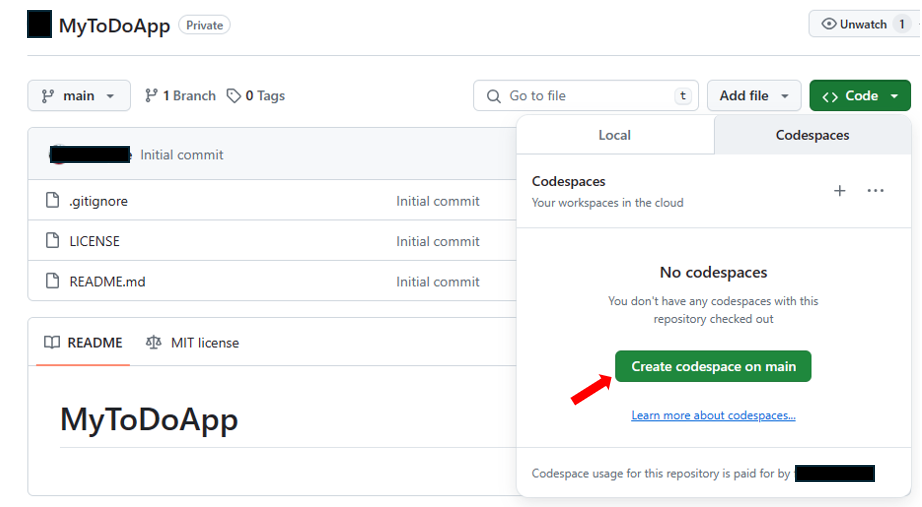
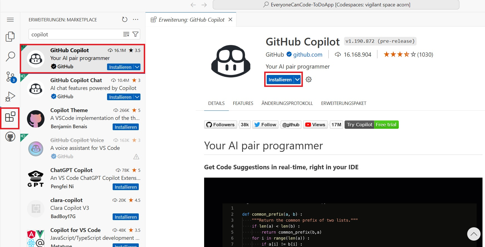

# Using GitHub CodeSpaces
⏲️ _Est. time to complete: 10 min._ ⏲️

## Here is what you will learn 🎯
You will learn the following:
- What is GitHub Codespaces and how it can benefit your development process.
- How to create and stop GitHub Codespaces.
- How to install and use extensions in a Codespace.

## Table Of Contents
- [Introduction to GitHub Codespaces](#introduction-to-github-codespaces)
- [Creating and Stopping a GitHub Codespace](#creating-and-stopping-a-github-codespace)

## Introduction to GitHub Codespaces
We will use something called Codespaces, which is a feature provided by GitHub. You can learn more about it [here](https://github.com/features/codespaces).

GitHub Codespaces is a cloud-based development environment. It's like a virtual coding setup that lives on the internet, not on your personal computer. It allows you to write, run, debug, test, save different versions of your code (commit), and share your code with others (push), all from your web browser. This means you don't need to set up a local development environment on your computer, which can be a complex and time-consuming process, especially for beginners.

Here are some of the advantages of using Codespaces:

- **No setup required**: You don't need to install any software or configure your computer to start coding. Just open a Codespace, and you're ready to go!

- **Consistent environments**: Each Codespace is isolated and consistent. This means you won't run into issues like "it works on my machine but not on yours".

- **Powerful and flexible**: Codespaces are powered by Visual Studio Code and support a wide range of programming languages and tools. You can customize your Codespace with extensions and settings to fit your workflow.

- **Accessible from anywhere**: As long as you have an internet connection, you can access your Codespace from any device, anywhere in the world.

- **Limited free usage**: GitHub provides up to 60 hours of free usage of Codespaces per month. This makes it a cost-effective solution for beginners and small projects.

Now that you know what Codespaces is and why it's useful, let's dive into how to use it in our project!

## Creating and Stopping a GitHub Codespace

Creating a new Codespace is easy, when you know where to look:

1. Navigate to the main page of the GitHub repository for which you want to create a Codespace.  For this exercise you will be using the repository you just created in the previous step. 
2. Click on the green "Code" button on the top right and switch from the _Local_ to the _Codespaces_ tab.
3. Click on the "Create Codespace on main" button. GitHub will now create a new Codespace and open it in a new browser window. It might take a few minutes to load but just like that you're done!

To stop a Codespace, follow these steps:

1. Go back to the main page of the GitHub repository (the tab should still be open in your web browser) 
2. Click on the three dots in the top right corner of the Codespace window.
3. Select "Stop Codespace". Your Codespace will now be stopped and closed. You can reopen it later by returning to your repository and selecting the same Codespace from the list.

> [!WARNING]
> If you do not explicitly stop a codespace, it will continue to run until it times out from inactivity. Closing a codespace does not stop the Codespace.

> [!TIP]
> You can make your own Codespace development environment by creating a Dev Container and have it run on your own Docker or Kubernetes platform. Check out **[Create a Dev Container](https://code.visualstudio.com/docs/devcontainers/create-dev-container)** to get started. 

## Add Extensions

In this step, you will learn how to add extensions to your Codespace using the example of the GitHub Copilot extension: 
1. Click on the Extensions icon on the left sidebar. It looks like a square puzzle piece.
2. In the search bar at the top, type "GitHub Copilot" and press Enter.
3. Look for the "GitHub Copilot" extension in the search results and click on it.
4. On the extension page, you will see an "Install" button. Click on it to start the installation process.
5. Approach your coach to get your free GitHub Copilot voucher.
6. Congratulations! You have successfully added GitHub Copilot as an extension to your Visual Studio Code.

Now, GitHub Copilot will assist you while you write code by providing helpful suggestions and completing code snippets for you. It's like having an AI coding buddy by your side!
Remember, GitHub Copilot is designed to help you write code faster and more efficiently, but it's always a good idea to understand the code it suggests and make sure it aligns with your intentions. Happy coding with GitHub Copilot!

We hope this helps you understand how our project is set up in Codespaces. Happy coding!

[🔼 Sprint 0 - Home](readme.md) | [◀ Previous setup step](./02%20-%20Setup%20To-Do%20Application%20Repository.md) | [Next Sprint ▶](/Track_1_ToDo_App/Sprint-01%20-%20Basic%20Application/README.md)
