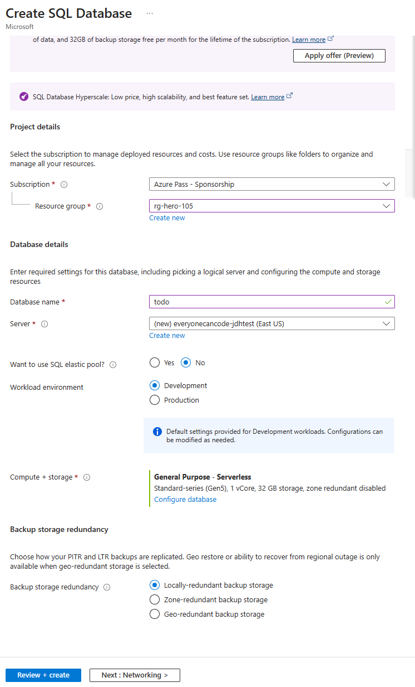
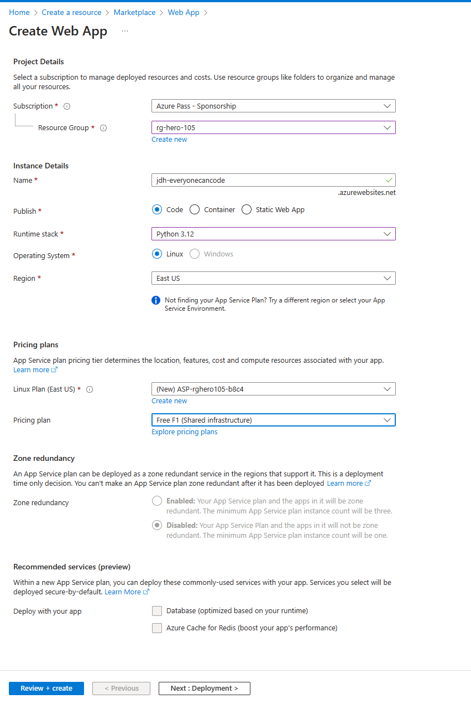
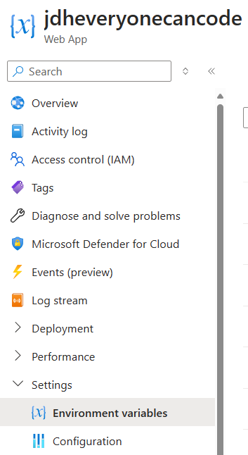
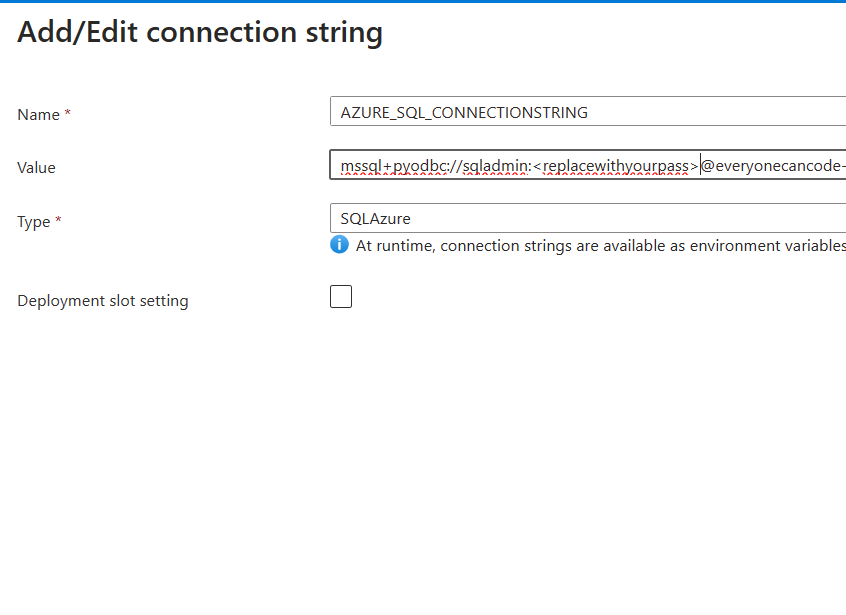
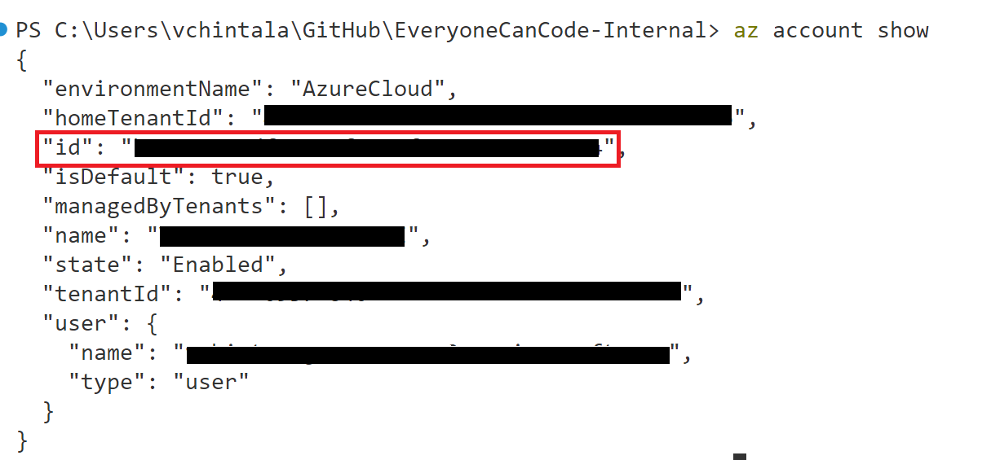
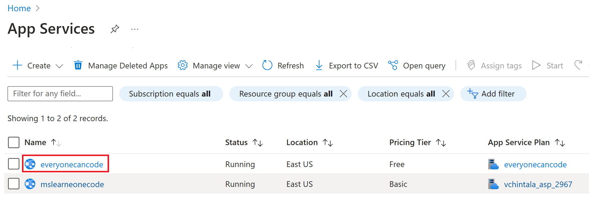
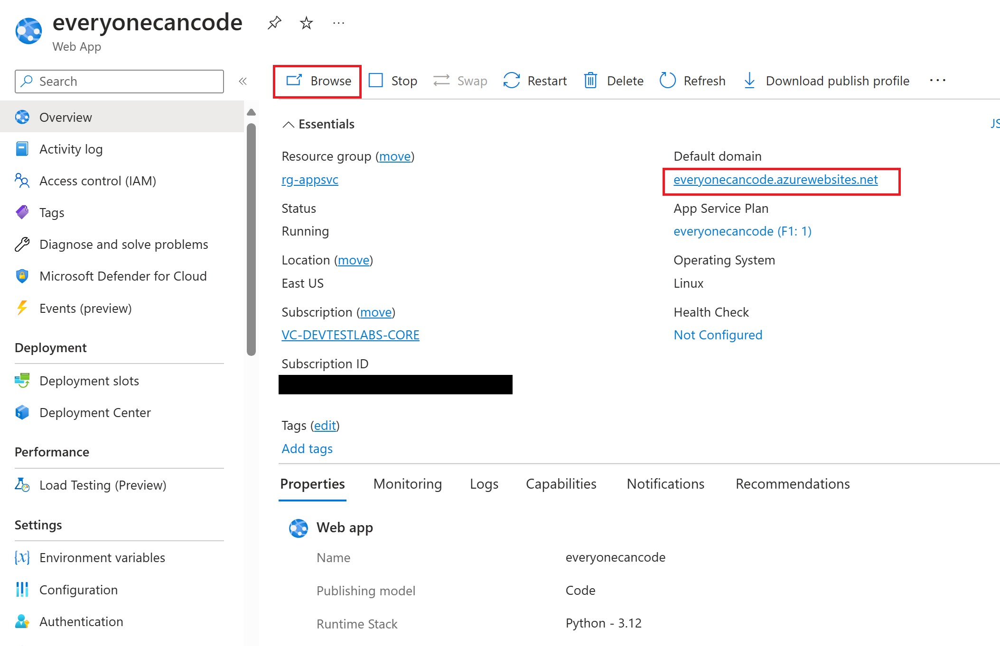
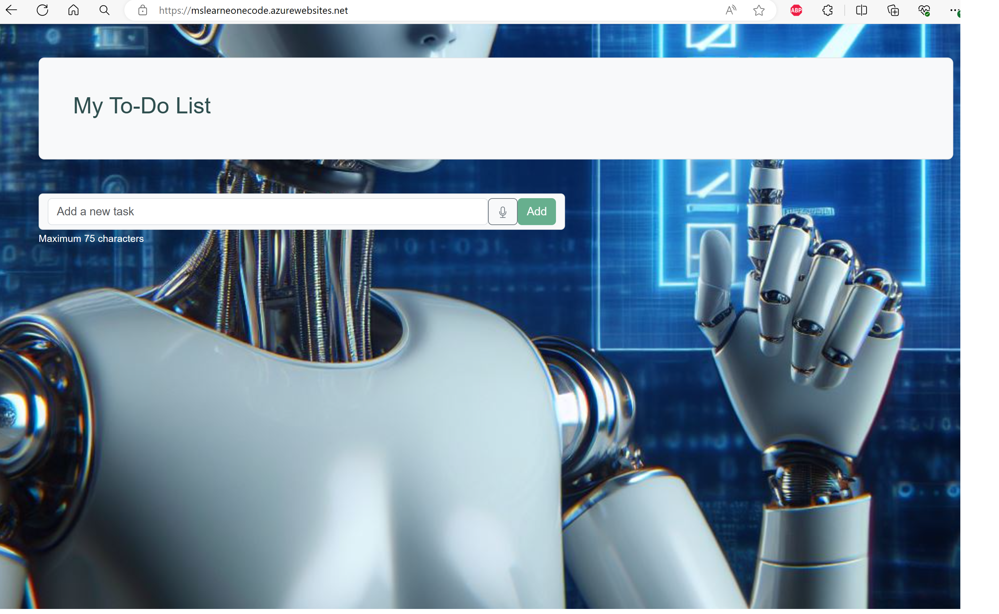

# User Story: Deploy to Azure Step-by-Step
⏲️ _Est. time to complete: 30 min._ ⏲️

## User Story

As a user I want to deploy my solution to the cloud so that I can access my application at any time.

## 🎯Acceptance Criteria:
- Azure SQL Database named _todo_ is created and todo items are persisted by the application.
- Azure App Service is with Python runtime environment is created and deployed application.
- Created database connection string using the Azure SQL Database information to connect through my application to persist todo items.
- Configured Azure OpenAI information to access as environment variables using Azure App Service settings in my application.

## 🎓Know Before You Start
The following resources/videos will help you get a better understanding of some of the concepts that you will use to complete this user story.

- [What is Cloud Computing](https://learn.microsoft.com/en-us/training/modules/describe-cloud-compute/3-what-cloud-compute) (~3 minutes) <br/>

## 📋Steps

In order to complete this user story you will need to complete the following tasks:

### Setup Your Azure Cloud Environment

#### 1. Login in to the Azure Portal
To use Azure we will first need to login with our Azure credentials.  If you are part of the event, you will be given Azure credentials by your coach.  If you are doing this exercise outside of the event you can sign-up for Azure [here](https://azure.microsoft.com/en-us/) and then provide those credentials when completing this exercise.


> [!NOTE]
> If you are not part of the 2 day Everyone Can Code Event, you can use your Azure credentials or you can sign up [here to get started](https://azure.microsoft.com/en-us/free/).
<br/>

#### 2. Setup Azure Sql Database
Choose **create a resource** option from the home page


Search for **sql database** in the search box


Select SQL Database option to go to the create screen


On the create screen, select create and then complete the form as follows, keeping defaults for everything except the following:

* choose a resource group (or create a new one if one is not provided or you are not sure here).
* **database name:** todo
* **Server:** You will need to create a new server, click the *create new* link and complete the form for creating a server as follows:

* **Server Name:** everyonecancode-<random> (replace random with a unique set of characters to make this globally unique)
* **Region:** East US. Choose a region appropriate for where you are deploying the app. If you are in the US, East US is ok as starting point if you are unsure.
* **Authentication:** Change the selection to *Use SQL Authentication** and enter an admin username (e.g. sqladmin) and unique password


* **Backup Storage Redundance:** Change to *Locally-redundant backup storage* 

Click *Review and Create* and then *Create* to start getting your database provisioned.



### Setting up an Azure Web App Service
Now that we have setup the database we have to create the Azure Web App Service to host our web app.

#### 1. Set up Azure Web App Service in Azure Portal

Go back the home page of your Azure Portal and click *Create a Resource* again. This time, enter *Web App* in the search box and choose the Web App option.


On the next screen hit create. Complete the form as follows, changing the following items and keeping defaults for all others:

* **Resource Group:** Choose the resource group you used for your Azure SQL Database
* **Name:** Give your webapp a unique name that no one else in the world will use (e.g. <yourinitials-everyonecancode>)
* **Runtime Stack:** choose Python 3.12
* **Pricing Plan:** Choose Free Tier

Hit *Review and Create* and the *Create* to provision your Web App



### Deploy App To Azure

Go to your source code in Visual Studio Code. We will need to make some minor adjustments to the app to prepare it for deploying to Azure.

#### 1. Create requirements.txt file to install Python modules

To deploy this application to Azure the Python code in this application depends on other Python modules. These modules are not readily available when you create a new Web Application in Azure App Service. To deploy these dependent modules you need to prepare a requirements.txt file, which is then used by Azure App Service to deploy these modules to run the application. Create a top level file (at the same level as your app.py file) called requirements.txt and add the following to it.

```python
openai
flask
flask[async]
flask_sqlalchemy
sqlalchemy
semantic_kernel
pyodbc
fastapi
```

#### 2. Update code to use Azure App Service database connection string environment variable

Open `app.py` file, find these lines of code near the top of the file:

```python
basedir = os.path.abspath(os.path.dirname(__file__))   # Get the directory of the this file
todo_file = os.path.join(basedir, 'todo_list.txt')     # Create the path to the to-do list file using the directory
app.config["SQLALCHEMY_DATABASE_URI"] = 'sqlite:///' + os.path.join(basedir, 'todos.db')
app.config['SQLALCHEMY_TRACK_MODIFICATIONS'] = False
```
and replace these with the following lines:

```python

# mssql+pyodbc://<sql user name>:<password>@<azure sql server>.database.windows.net:1433/todo?driver=ODBC+Driver+17+for+SQL+Server
connection_string = os.environ.get("SQLAZURECONNSTR_AZURE_SQL_CONNECTIONSTRING", '')

# Use local database if Azure SQL server is not configured
if not connection_string:
    print('Azure SQL not configured, Using local SQLLite database')
    basedir = os.path.abspath(os.path.dirname(__file__))   # Get the directory of the this file
    print('Base directory:', basedir)
    todo_file = os.path.join(basedir, 'todo_list.txt')     # Create the path to the to-do list file using the directory
    app.config["SQLALCHEMY_DATABASE_URI"] = 'sqlite:///' + os.path.join(basedir, 'todos.db')
else:
    print('Using Azure SQL database')
    app.config["SQLALCHEMY_DATABASE_URI"] = connection_string

```

Pay attention to the _SQLAZURECONNSTR_AZURE_SQL_CONNECTIONSTRING_ environment variable is in this code snippet. The prefix **SQLAZURECONNSTR_** indicates it is a Azure SQL database connection string environment variable. You will create this environment variable later steps.

#### 3. Update recommendations engine code to use Azure App Service environment variables

Open _recommendation_engine.py_ file and replace all the code from the first 13 lines with this code:

```python
import os
import json
import asyncio
from services import Service
from openai import AzureOpenAI

deployment = os.environ.get("AZURE_OPENAI_DEPLOYMENT_NAME", '')
api_key = os.environ.get("AZURE_OPENAI_API_KEY", '')
endpoint = os.environ.get("AZURE_OPENAI_ENDPOINT", '')
use_open_ai = os.environ.get("USE_AZURE_OPENAI", 'True')

#uses the USE_AZURE_OPENAI variable from the .env file to determine which AI service to use
#False means use OpenAI, True means use Azure OpenAI
selectedService = Service.AzureOpenAI if use_open_ai == "True" else Service.OpenAI
```

#### 4. Add Azure Web App Config Settings

Go back to the browser, navigate to the Azure Portal and find your Web App you deployed earlier. Open the web app and navigate to the Settings->Environment Variables section



Under App Settings add the following settings and the values you have used prior
AZURE_OPENAI_KEY: (use key from prior sprints)
AZURE_OPENAI_DEPLOYMENT_NAME: gpt-35-turbo
AZURE_OPENAI_ENDPOINT: (use endpoint from prior sprints)
USE_AZURE_OPENAI: True

And then switch to the connection strings section and add the following connection string, replacing the password with the one you used when you created your SQL Database.



#### 5. Install Azure CLI

The easiest way to deploy your app is via the Azure CLI. To get started, we will first need to install the Azure CLI to help us deploy this application to the cloud.  If you are not familiar with the Azure CLI you can learn more at the following link: [What is the Azure CLI?](https://learn.microsoft.com/en-us/cli/azure/what-is-azure-cli)

- If you are running in a **Codespace and/or Linux**, you should run the following command:

  ```bash
  curl -sL https://aka.ms/InstallAzureCLIDeb | sudo bash
  ```

  You can also reference [Install the Azure CLI on Linux](https://learn.microsoft.com/en-us/cli/azure/install-azure-cli-linux?pivots=apt) for more information.

- If you are running on **Windows**, you should run the following installers:
  - [MSI for Azure CLI Windows 32-bit](https://aka.ms/installazurecliwindows)
  - [MSI for Azure CLI Windows 64-bit](https://aka.ms/installazurecliwindowsx64)

  You can also reference [Install Azure CLI on Windows](https://learn.microsoft.com/en-us/cli/azure/install-azure-cli-windows?tabs=azure-cli) for more information.

- If you are running on **macOS**, you can install via Homebrew:

  ```
  brew update && brew install azure-cli
  ```

  You can also reference [Install Azure CLI on macOS](https://learn.microsoft.com/en-us/cli/azure/install-azure-cli-macos) for more information.

In VS Code, open new terminal window and run the command below to login to Azure resource management. A browser window will be opened and redirected to Microsoft Entra ID to complete login to Azure resource management.

- If running on your **local machine**:

  ```powershell
  az login
  ```
- If running in **Codespaces**

  ```powershell
  az login --use-device-code
  ```

  Then follow the instructions in the terminal window to log into a browser and provide the **code** that is displayed.

#### 6. Set default subscription to deploy Azure resources
Once the login is complete run the command below to verify your tenant and subscriptions. If this command shows more than one subscription, copy the subscription ID of the subscription that you would like to deploy your application to and set as default subscription for Azure SQL Database.

```powershell
az account show
az account set --subscription <SubscriptionID>
```



#### 7. Deploy the Web App
Run the following command to deploy the web app (replace xxx and yyy with the values from earlier when you created the web app.)

```powershell
az webapp up --name xxx --resource-group yyy
```

### See the application in action

#### 1. Login to Azure Portal

Login to Azure Portal to view Azure App Service just deployed and configure, and search for App Services as shown below.

  

#### 2. Location Azure App Service

Locate the App Service just deployed by identifying with the name and click on the name to open service overview.

  

#### 3. Access Application in Web Browser

Click on the _Browse_ or _Default domain name_ in the App Service overview page. Web page will open in a different tab, and if everything is working expected you should be able to view web page as shown below.

  

  

> [!WARNING]
> Please note that **your to-do application** once deployed to the cloud **is running on the public internet and is accessible by anyone that has the URL to view and/or edit  information.  So please do not put personal items in your to-do list**.   We would **highly recommend that you setup security on the website** if you would like to continue to run it and use the to-do list functionality. 

<br/>
🎉 Congratulations! You have now successfully deployed your to-do application to the Azure cloud.

<br/>

> [!NOTE]
> 📄For the full source code for this exercise please see [here](/Track_1_ToDo_App/Sprint-08%20-%20Deploy%20to%20the%20Cloud/src/app-s08-f01-us01/).

<br/>

[🔼 **Home** ](/Track_1_ToDo_App/README.md) | [**◀ Previous user story** (in previous sprint) ](/Track_1_ToDo_App/Sprint-07%20-%20Advanced%20Styling%20Your%20Web%20App/Feature%201%20-%20Advanced%20Styling/User%20Story%205%20-%20Show%20Spinner.md)
